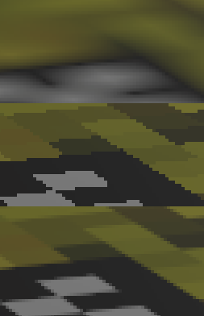
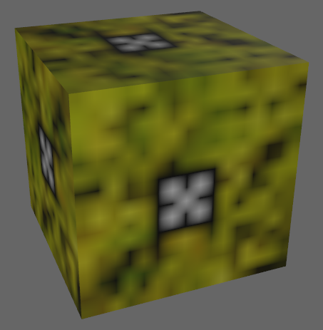
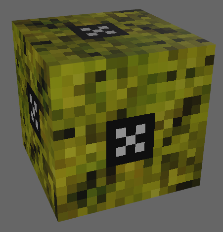
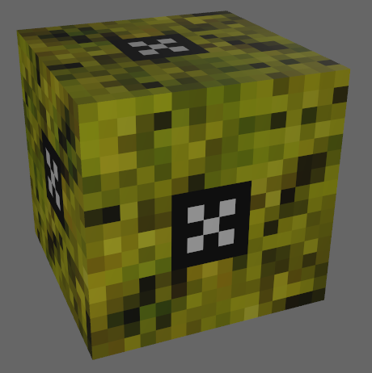

# Bevy Blocky Sampling
Example Project showing how to implement basic AA for blocky textures.

Depends on bevy 0.8

This anti aliased sampling technique is implemented at the texture sampling stage rather than as post process. Making use of bilinear interpolation, it only samples the texture a single time.

Close-up compairson of sampling options:

Press 1 for linear sampling:

Press 2 for nearest neighbor sampling:

Press 3 for antialiased blocky sampling:

Shader ported from glsl to wgsl from https://www.shadertoy.com/view/ltfXWS